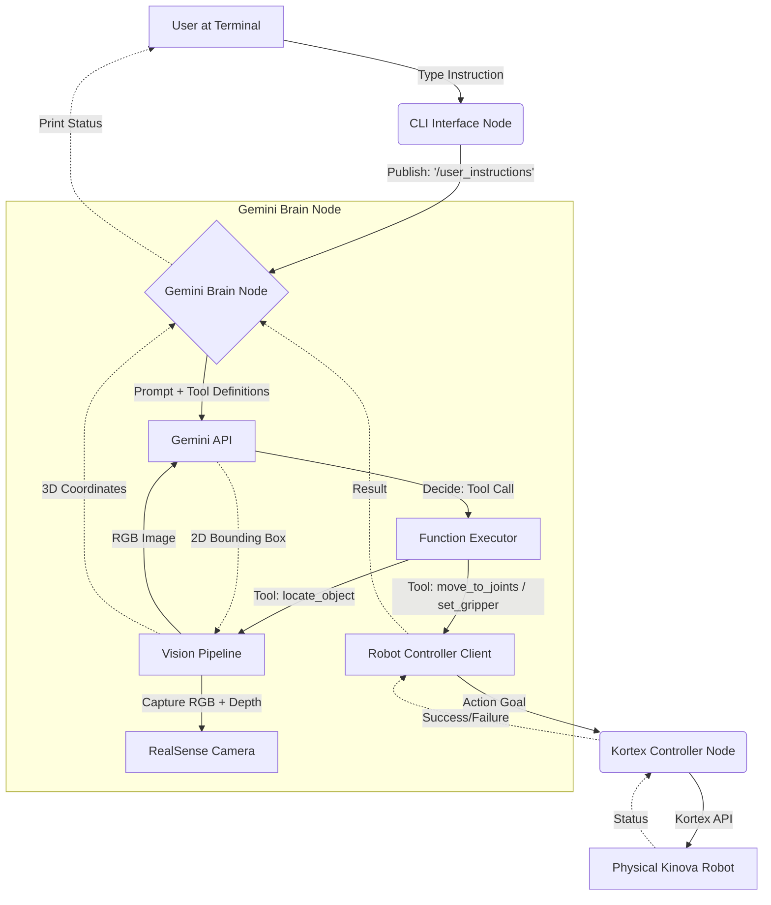

# Software Architecture Plan: Gemini Function Calling for Kinova Gen3

## Goal
Implement a modular system where a user can type natural language instructions into a terminal, and the **gemini-robotics-er** model uses **Function Calling** to trigger ROS2 actions and vision-based tasks.

## Proposed Architecture

### 1. New Package: `gemini_robotics` (Python)
This will be the central "Brain" of the integration.

*   **`gemini_brain_node.py`**:
    *   **Gemini Client**: Manages communication with the Google GenAI SDK (using `gemini-robotics-er`).
    *   **Tool Definitions**:
        *   `move_to_joints(angles)`: Physical actuation.
        *   `set_gripper(position)`: End-effector control.
        *   `locate_object(description)`: **(New)** Triggers the vision pipeline.
    *   **Function Executor**: Maps responses to `KinovaRobotControllerROS2` or the internal Vision Pipeline.
    *   **Instruction Subscriber**: Listens to `/user_instructions`.

### 2. Input Node: `text_interface_node.py`
*   **Purpose**: CLI for manual testing. Publishes to `/user_instructions`.

### 3. Execution Node: `kortex_controller` (Existing C++)
*   **Role**: Low-level executor (ROS2 Action Servers).

---

## Workflow Diagram

---

## Execution Flow Examples

### Example 1: Simple Movement
1.  **User**: "Move to home."
2.  **Gemini**: Calls `move_to_home()`.
3.  **Executor**: Triggers robot action.

### Example 2: Vision-Guided Task
1.  **User**: "Pick up the plate."
2.  **Gemini**: "I need coordinates. Calling `locate_object('plate')`."
3.  **Vision Pipeline**:
    *   Captures 1 RGB frame + Aligned Depth.
    *   Sends RGB to `gemini-robotics-er`.
    *   Gemini returns 2D bounding box.
    *   Pipeline calculates center pixel $(u, v)$ and looks up depth $Z$.
    *   Returns 3D coordinates $(x, y, z)$ (Camera Frame).
4.  **Gemini**: Receives coordinates. Calls `move_to_pose(x, y, z)`.
5.  **Executor**: Triggers robot motion.

---

## Vision Integration Strategy
**Strategy: "Tool-Based Vision"**
To minimize latency, we will **not** send a continuous video feed. Vision is a tool called on-demand.

*   **Model**: `gemini-robotics-er` (Handles both reasoning and vision).
*   **Workflow**:
    1.  **Capture**: `gemini_brain_node` triggers RealSense wrapper for a single frame.
    2.  **Query**: Image sent to Gemini with prompt: *"Locate the [description]. Return bounding box."*
    3.  **Depth Lookup**: Use aligned depth map at the center pixel.
    4.  **Projection**: Convert Pixel + Depth $\to$ 3D Point (Camera Frame).
    5.  **Action**: Return 3D point to the Brain for decision making.

*   **Note on Transforms**: Initially, coordinates will be relative to the **camera**. We will implement TF (Base $\to$ Camera) later.
