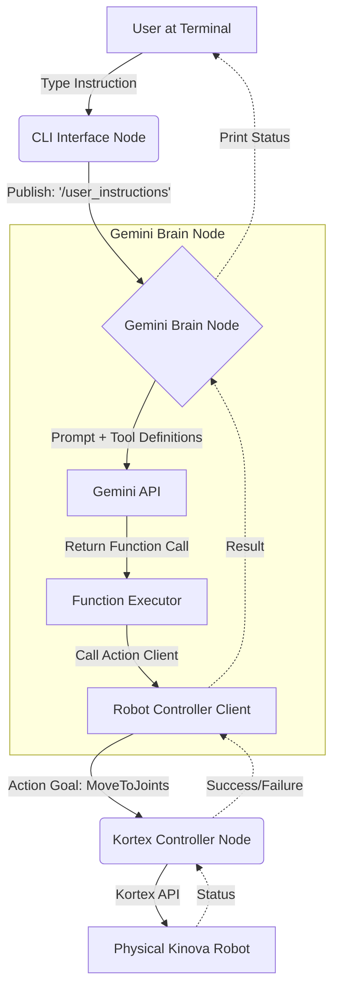

# Software Architecture Plan: Gemini Function Calling for Kinova Gen3

## Goal
Implement a modular system where a user can type natural language instructions into a terminal (e.g., "Open the gripper halfway" or "Move to the home position"), and the Gemini model uses **Function Calling** to trigger ROS2 actions.

## Proposed Architecture

This plan uses a ROS2-centric approach to ensure that future inputs (like voice) or outputs (like vision-guided coordinates) can be integrated as separate, interchangeable nodes.

### 1. New Package: `gemini_robotics` (Python)
This will be the central "Brain" of the integration.

*   **`gemini_brain_node.py`**:
    *   **Gemini Client**: Manages communication with the Google GenAI SDK.
    *   **Tool Definitions**: Contains the JSON schemas for the functions Gemini can call (e.g., `move_to_joints(angles)`, `set_gripper(position)`).
    *   **Function Executor**: A bridge that maps Gemini's "Function Call" responses to actual calls to the `KinovaRobotControllerROS2` client (already in `src/scripts`).
    *   **Instruction Subscriber**: Listens to a topic (e.g., `/user_instructions`) for raw text strings.

### 2. Input Node: `text_interface_node.py`
*   **Purpose**: A simple CLI for manual testing.
*   **Function**: Uses Python's `input()` to capture user text and publishes it to the `/user_instructions` topic.
*   **Future Modularity**: When you are ready for voice, you can create a `voice_interface_node.py` that uses a Speech-to-Text library to publish to that same topic. No changes would be needed in the "Brain" node.

### 3. Execution Node: `kortex_controller` (Existing C++)
*   **Role**: Remains the low-level executor. It provides the ROS2 Action Servers that the Python nodes interact with.

---

## Workflow Diagram

---

## Execution Flow Example

1.  **User Types**: "Move to the home position."
2.  **CLI Node**: Publishes the string `"Move to the home position"` to `/user_instructions`.
3.  **Brain Node**:
    *   Receives the string and sends it to Gemini along with the defined tools.
    *   Gemini identifies that this matches the `move_to_joints` tool.
    *   Gemini returns a function call: `move_to_joints(joint_angles=[359.9, 4.3, ...])`.
4.  **Function Executor**: Receives the function call and executes `await controller.move_to_joints(...)`.
5.  **Kortex Node**: Receives the ROS2 action goal, moves the physical arm, and returns a "Success" result.
6.  **Brain Node**: Prints `[INFO] Movement successful.` to the terminal.

## Why This Works for You
- **Responsive**: No waiting for a second API call after the robot finishes moving.
- **Modular**: The "How I get instructions" (Text vs. Voice) is separated from "How I reason" (Gemini) and "How I move" (Kortex).
- **Simple to Start**: You don't need to touch the complex C++ code or the Vision transforms yet.
- **Scalable**: When you add `move_to_pose` later, you just add one new "Tool" to the Brain node.
