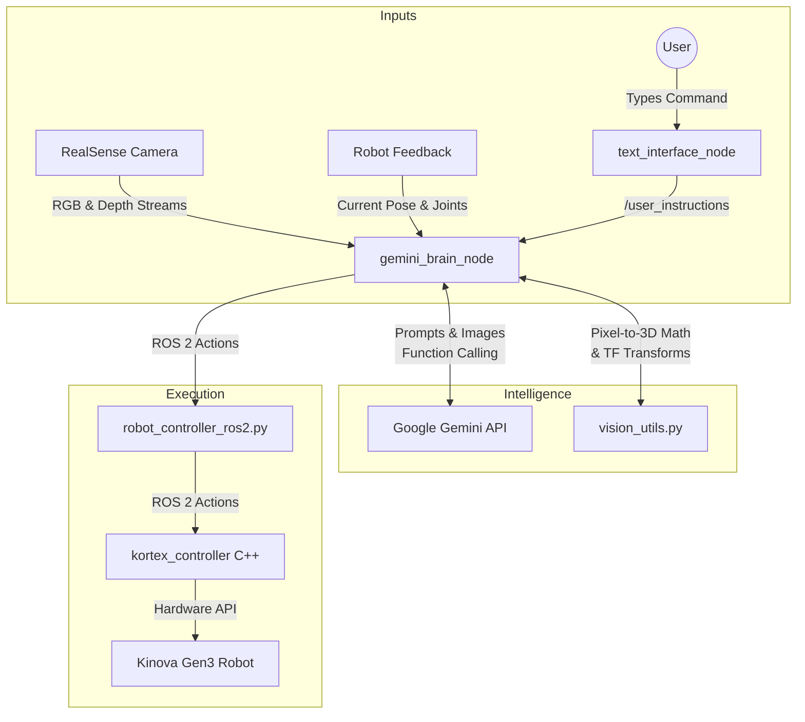

# Software Architecture Plan: Gemini Function Calling for Kinova Gen3

## Goal
Implement a modular system where a user can type natural language instructions into a terminal, and the **gemini-robotics-er** model uses **Function Calling** to trigger ROS2 actions and vision-based tasks.

## Proposed Architecture

### 1. New Package: `gemini_robotics` (Python)
This will be the central "Brain" of the integration.

*   **`gemini_brain_node.py`**:
    *   **Gemini Client**: Manages communication with the Google GenAI SDK (using `gemini-robotics-er`).
    *   **Tool Definitions (Gemini-Callable Functions)**:
        *   `move_to_joints(joint_angles)`: Moves the 7 DOF arm to specific joint angles (in degrees). Used for hardcoded or precisely known configurations.
        *   `set_gripper(position)`: Opens or closes the Robotiq 2F-140 gripper. Position is a value from 0 (fully open) to 100 (fully closed).
        *   `move_to_home()`: A convenience function that commands the robot to return to a predefined safe "home" configuration defined in `config.yaml`.
        *   `move_to_object(description)`: Triggers the complete vision-to-action pipeline. It uses the RealSense camera to capture RGB-D images, asks Gemini to segment the object described by the `description` string, calculates the object's 3D coordinate relative to the base, and automatically moves the robot's end-effector to that location.
    *   **Function Executor**: Maps Gemini's requested function calls to the ROS 2 Action Client (`KinovaRobotControllerROS2`) or executes the internal Vision Pipeline.
    *   **Instruction Subscriber**: Listens to the `/user_instructions` ROS 2 topic for user commands.

### 2. Input Node: `text_interface_node.py`
*   **Purpose**: CLI for manual testing and interaction. Captures text input from the user and publishes it to the `/user_instructions` topic.

### 3. Execution Node: `kortex_controller` (Existing C++)
*   **Role**: Low-level executor hosting ROS 2 Action Servers (`MoveToPose`, `MoveToJoints`, `GripperCommand`). Connects directly to the Kinova robot via the Kortex API over TCP.

---

## Workflow Diagram

---

## Execution Flow Examples

### Example 1: Simple Movement
1.  **User**: "Move to home and open the gripper."
2.  **Gemini**: Analyzes the request and sequentially calls `move_to_home()` and `set_gripper(position: 0)`.
3.  **Executor**: Triggers the respective robot actions via the `KinovaRobotControllerROS2` action client.

### Example 2: Vision-Guided Task
1.  **User**: "Move the arm over to the blue block."
2.  **Gemini**: Recognizes a spatial target and calls `move_to_object(description: 'blue block')`.
3.  **Vision Pipeline**:
    *   Waits for and captures synchronized RGB and Aligned Depth frames from the RealSense topics.
    *   Sends the RGB image and a prompt requesting a segmentation mask for 'blue block' to the Gemini API.
    *   Gemini returns the segmentation mask coordinates as JSON.
    *   The pipeline overlays the mask on the depth image and calculates the **median depth** of the segmented object to ignore noise or outliers.
    *   Calculates the centroid pixel $(u, v)$ of the mask.
    *   Uses RealSense camera intrinsics (focal length, principal point) to project the pixel and depth into a 3D coordinate $(X, Y, Z)$ in the `realsense_link` frame.
    *   Uses ROS 2 TF2 (`tf_buffer.lookup_transform`) to transform the 3D coordinate from `realsense_link` to the robot's `base_link`.
    *   Sends a `MoveToPose` action goal to the controller with the new base coordinates, maintaining the current end-effector orientation.
4.  **Executor**: Triggers the robot motion to the object.

---

## Vision Integration Strategy
**Strategy: "Tool-Based Vision"**
To minimize latency and token usage, we do **not** send a continuous video feed to the model. Vision is treated as a tool, invoked on-demand when spatial understanding is required.

*   **Model**: `gemini-robotics-er` (Handles both logical reasoning and 2D spatial extraction).
*   **Workflow**:
    1.  **Capture**: `gemini_brain_node` pulls the latest frame from the `/camera/...` topics.
    2.  **Query**: The image is sent to Gemini with a prompt: *"Return segmentation masks for: [description]."*.
    3.  **Mask Processing**: The JSON response is decoded into a bitmask and resized to match the original image resolution. 
    4.  **Depth Lookup**: The depth values corresponding to the "True" pixels of the mask are extracted from the aligned depth image, and the median depth is computed.
    5.  **Projection & Transform**: The 2D centroid and median depth are projected into 3D space using the camera's intrinsic parameters (dynamically subscribed via `CameraInfo`). The point is then transformed to the robot's base frame using the static TF tree.
    6.  **Action**: A movement command is dispatched autonomously by the pipeline using the calculated coordinates.
