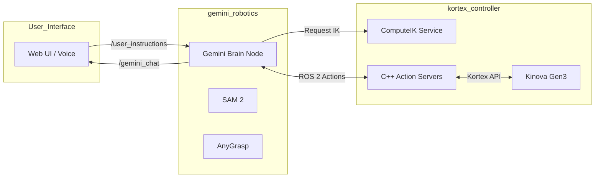
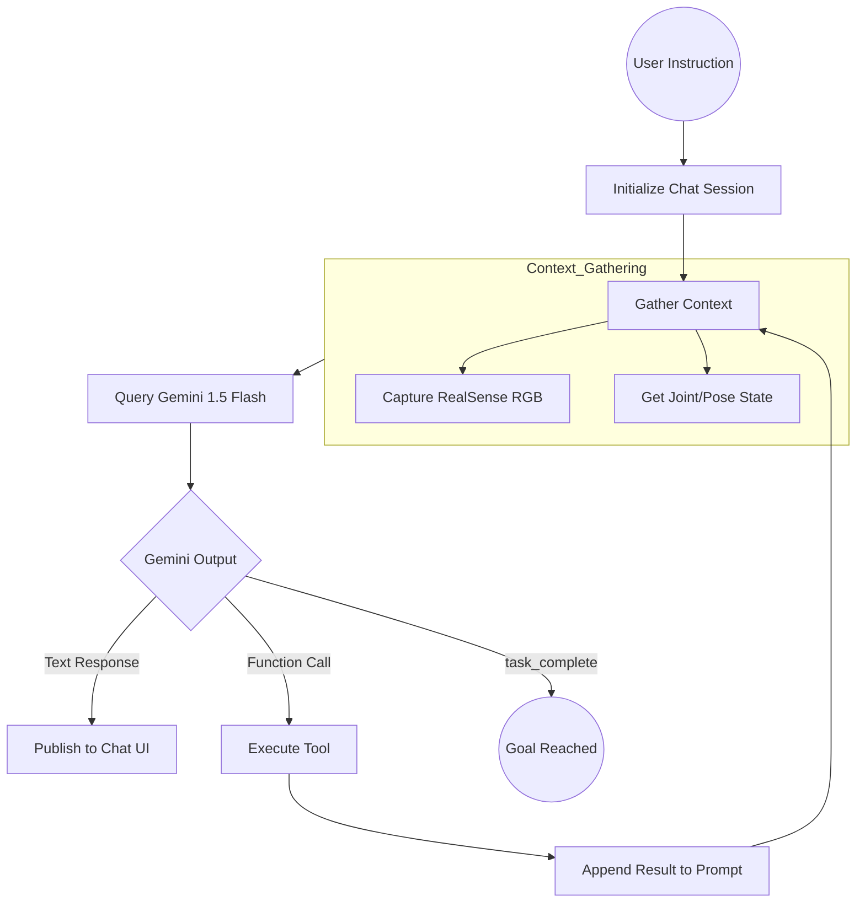
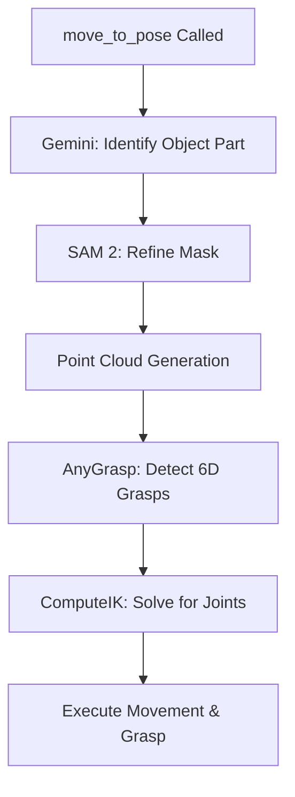
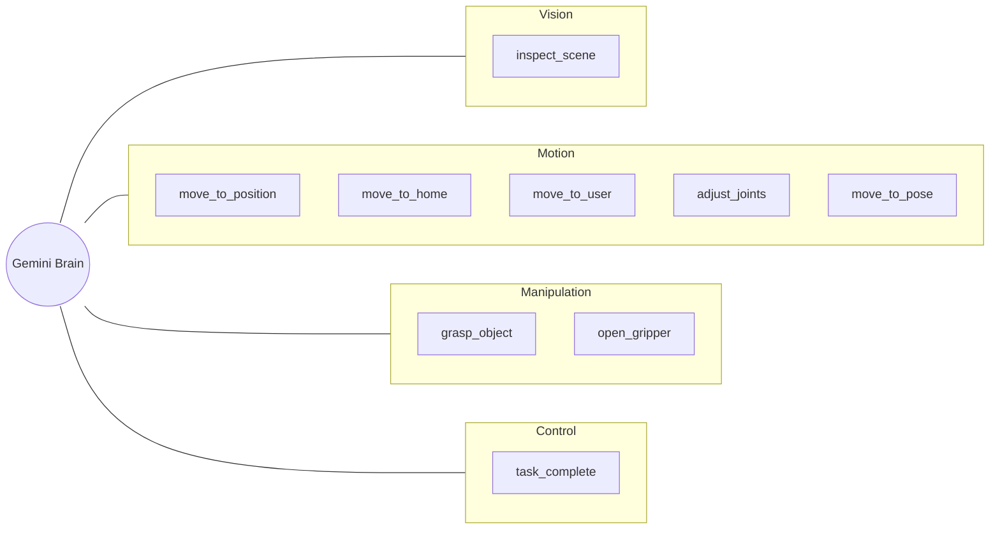

# Software Architecture: Gemini-Guided Kinova Gen3 Robotics

## Overview
This document describes the modular system architecture where a user can provide natural language instructions, and the **Gemini Robotics** model orchestrates the robot's actions. The system uses a multi-turn "Reasoning-Action" loop, incorporating live visual feedback from a wrist-mounted RealSense camera and advanced vision models (SAM 2, AnyGrasp) to achieve complex, long-horizon tasks.

## Architecture

### 1. Core Package: `gemini_robotics` (Python)
The central "Brain" of the integration.

*   **`gemini_brain_node.py`**:
    *   **Model Strategy**:
        *   **Gemini 1.5 Flash**: Orchestrates multi-step reasoning and provides initial object localization via bounding boxes.
    *   **Vision Stack**:
        *   **SAM 2**: Refines Gemini's bounding boxes into high-precision segmentation masks.
        *   **AnyGrasp**: Processes segmented point clouds to detect 6D grasp poses.
    *   **Tool Definitions (Gemini-Callable Functions)**:
        *   `inspect_scene()`: Triggers the vision pipeline using SAM 2 and depth processing. Returns a semantic report of all objects and their 3D poses.
        *   `move_to_pose(object_label)`: Executes an autonomous 6D grasp. Combines Gemini, SAM 2, AnyGrasp, and IK.
        *   `move_to_position(x, y, z)`: Moves the end-effector to absolute Cartesian coordinates.
        *   `move_to_home()`: Returns to the observation pose.
        *   `move_to_user()`: Moves to a pose for user interaction.
        *   `grasp_object()`: Closes the gripper until contact.
        *   `open_gripper()`: Fully opens the gripper.
        *   `adjust_joints(joint_number, amount)`: Relative adjustment of a specific joint.
        *   `task_complete()`: Signals that the user's goal has been reached.

### 2. Execution Node: `kortex_controller` (C++)
*   **Role**: Executes low-level ROS 2 Actions via the Kinova Kortex API.
*   **IK Solver**: Provides the `compute_ik` service, which uses the robot's kinematic model to solve for joint angles given a 6D goal pose.

---

## System Architecture & Flow

### 1. High-Level Communication

### 2. The Reasoning Loop (Inside `gemini_brain_node`)

### 3. Advanced Grasping Pipeline (`move_to_pose`)

The `move_to_pose` tool represents the most advanced autonomous capability of the system.

---

## Technical Execution Deep-Dive: Autonomous 6D Grasping

Unlike simple pick-and-place, the `move_to_pose` tool uses a tiered approach to achieve robust manipulation in unstructured environments:

1.  **Part Identification (Gemini 1.5 Flash)**: Gemini is prompted to find the "most graspable part" of an object (e.g., the handle of a mug). It returns a normalized bounding box.
2.  **High-Precision Segmentation (SAM 2)**: The bounding box is passed to SAM 2, which generates a pixel-perfect binary mask. This is crucial for isolating the object from the background and other items.
3.  **Point Cloud Processing**: Using the RealSense depth map and the SAM 2 mask, the system extracts a dense 3D point cloud of only the target object.
4.  **6D Grasp Detection (AnyGrasp)**: The segmented point cloud is fed into AnyGrasp. AnyGrasp evaluates thousands of potential gripper poses, considering collisions and grasp quality, and returns the best 6D pose (position + orientation).
5.  **Inverse Kinematics (IK)**: The 6D pose is sent to the `compute_ik` service (C++). The solver finds the joint angles required to reach that pose. If the first pose is unreachable, the system automatically tries a 180-degree flip of the gripper.
6.  **Multi-Stage Execution**:
    *   **Pre-Grasp**: The robot moves to a position slightly offset from the target along the approach vector.
    *   **Grasp**: The robot slides forward into the final grasp pose.
    *   **Action**: The gripper is closed, and the object is secured.

---

## Tool Diagram

