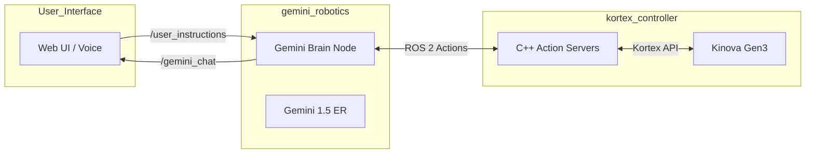
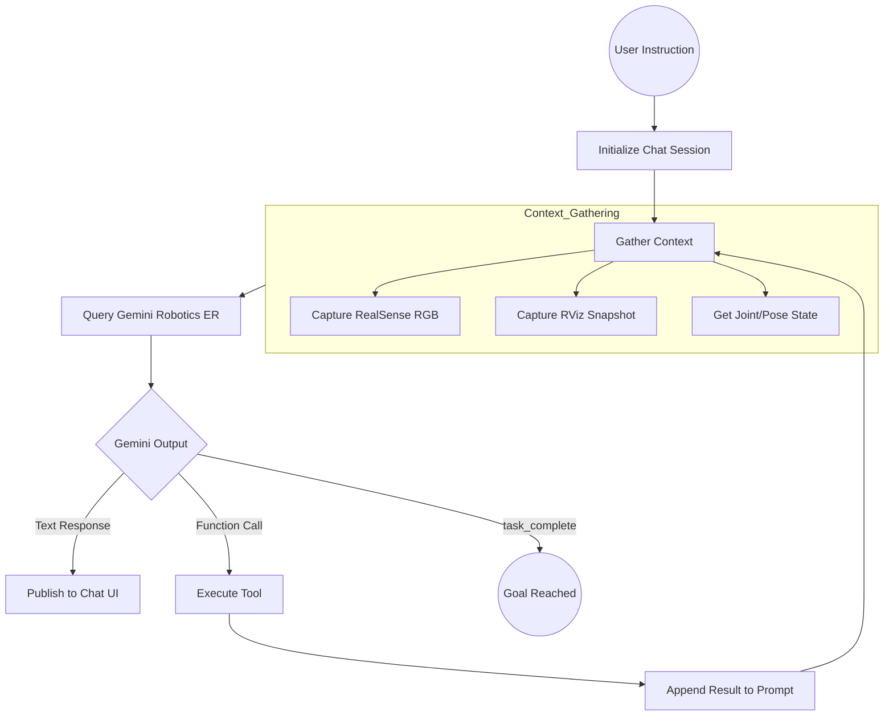
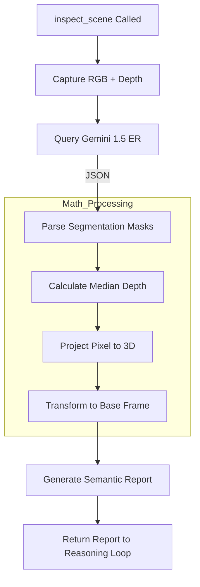
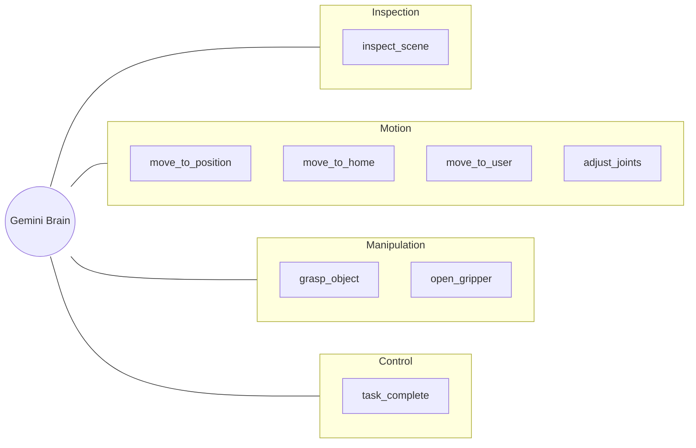

# Software Architecture: Gemini-Guided Kinova Gen3 Robotics

## Overview
This document describes the modular system architecture where a user can provide natural language instructions, and the **Gemini Robotics** model to orchestrate the robot's actions. The system uses a multi-turn "Reasoning-Action" loop, incorporating live visual feedback from both the physical environment (RealSense) and the robot's digital twin (RViz) to achieve complex, long-horizon tasks.

## Architecture

### 1. Core Package: `gemini_robotics` (Python)
The central "Brain" of the integration.

*   **`gemini_brain_node.py`**:
    *   **Model Strategy**:
        *   **Gemini 1.5 Robotics ER**: Model multi-step reasoning and high-precision visual object segmentation. Different Gemini models can be used by editing the `config.yaml` file.
    *   **Visual Feedback Loop**: Every reasoning turn includes:
        *   **RealSense View**: RGB image from the arm-mounted camera.
        *   **RViz Snapshot**: A "third-person" spatial view of the robot, base coordinate system, and the current RealSense pointcloud.
    *   **Tool Definitions (Gemini-Callable Functions)**:
        *   `inspect_scene()`: Triggers the vision pipeline. Returns a semantic report of all objects in the scene, their 3D poses (x, y, z) relative to the base, and an annotated image.
        *   `move_to_position(x, y, z)`: Moves the end-effector to absolute Cartesian coordinates in meters.
        *   `move_to_home()`: Returns to the observation pose looking down at the workspace.
        *   `move_to_user()`: Moves to a pose for hand-over or user interaction.
        *   `grasp_object()`: Closes the gripper until contact is detected.
        *   `open_gripper()`: Fully opens the gripper.
        *   `adjust_joints(joint_number, amount)`: Relative adjustment of a specific joint in degrees.
        *   `task_complete()`: Signals that the user's goal has been reached.
    *   **Instruction Subscriber**: Listens to `/user_instructions`.

### 2. Execution Node: `kortex_controller` (C++)
*   **Role**: Executes low-level ROS 2 Actions (`MoveToPose`, `MoveToJoints`, `GripperCommand`) via the Kinova Kortex API.

---

## System Architecture & Flow

### 1. High-Level Communication
The system is built on ROS 2, with the `gemini_brain_node` acting as the central orchestrator, communicating with the hardware and the user interface.

### 2. The Reasoning Loop (Inside `gemini_brain_node`)
This loop runs for every user command, allowing Gemini to "think" and "act" sequentially until the goal is met.

### 3. Vision Pipeline (`inspect_scene`)
A specialized sub-flow that converts visual pixels into actionable 3D coordinates.

---

## Technical Execution Deep-Dive

The power of this system lies in its **multi-modal feedback loop**. Unlike traditional robotics scripts that follow a fixed path, Gemini dynamically adjusts its plan based on what it "sees" and "feels."

### Step-by-Step Execution Flow

1.  **Goal Reception**: The user sends a command (e.g., "Grab the red mug"). This is received by the `GeminiBrainNode` via the `/user_instructions` topic.
2.  **Context Construction**:
    *   **Vision**: The node grabs the latest frame from the RealSense camera.
    *   **Spatial Awareness**: It uses `maim` to take a snapshot of the RViz window. This provides Gemini with an observer view of the robot's coordinate system and the surrounding pointcloud.
    *   **Proprioception**: It reads the exact joint angles and Cartesian coordinates from the `/robot_state` topic.
3.  **The "Reasoning" Turn**:
    *   The images and state data are sent to Gemini. 
    *   The model evaluates the scene against the goal. If it doesn't know where the "red mug" is, it will first call `inspect_scene()`.
4.  **Embodied Vision (ER)**:
    *   When `inspect_scene()` is called, the node switches to **Gemini 1.5 ER**.
    *   `inspect_scene()` uses **Gemini 1.5 ER** to return high-precision segmentation masks. The node then calculates the **Median of Mask** depth—taking all depth pixels within the object's mask and finding the median value to filter out noise.
    *   This depth is projected into 3D space and then transformed from the `camera_link` to the `base_link` using ROS 2 TF2.
5.  **Iterative Action**:
    *   The 3D coordinates are fed back to Gemini, which issues a movement command (e.g., `move_to_position(x, y, z)`).
    *   The node waits for the C++ `kortex_controller` to complete the action before starting the next turn of the loop.
6.  **Verification**: After moving, Gemini receives a fresh set of images. It can see if the gripper is actually around the mug. If it missed, it can adjust its joints or try again.
7.  **Finalization**: Once Gemini perceives that the mug is grasped and the user's ultimate goal is satisfied, it calls `task_complete()`, ending the process.

---

## Tool Diagram

---

## Execution Flow: Long-Horizon Task
*Example: "Put the toy in the box"*

1.  **Reasoning**: Gemini analyzes the goal and calls `inspect_scene()`.
2.  **Vision**: The pipeline identifies "toy" at `(0.4, -0.1, 0.05)` and "box" at `(0.5, 0.2, 0.1)`.
3.  **Action 1**: Gemini calls `move_to_position(x=0.4, y=-0.1, z=0.05)`.
4.  **Action 2**: Gemini calls `grasp_object()`.
5.  **Action 3**: Gemini calls `move_to_position(x=0.5, y=0.2, z=0.2)` (moving above the box).
6.  **Action 4**: Gemini calls `open_gripper()`.
7.  **Finalize**: Gemini calls `task_complete()`.

